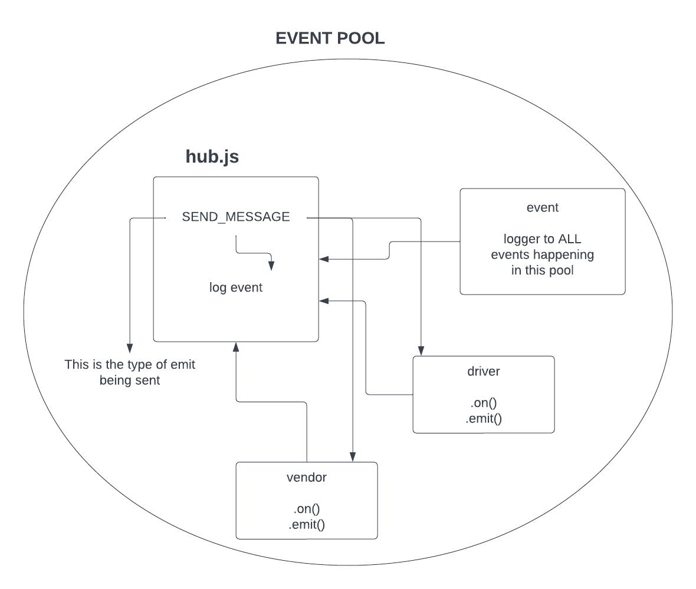
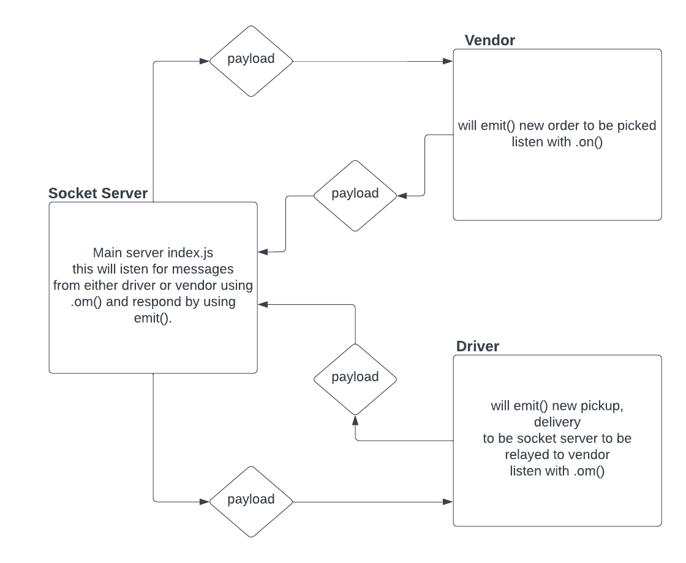
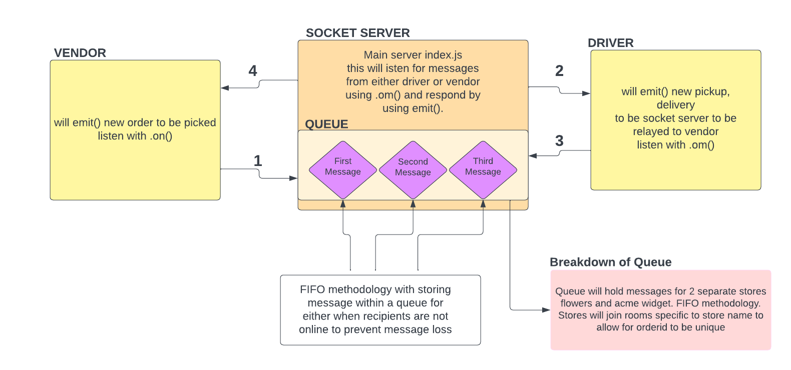

# Author: Kao Saelor

## Code Academy Parcel Service (CAPS)
A real-time service that allows for vendors, such as flower shops or restaurants, to alert a system of a package needing to be delivered, for drivers to instantly see what’s in their pickup queue, and then to alert the vendors as to the state of the deliveries (in transit, and then delivered).

## Business Requirements
As a business, our primary goal is to increase the visibility on the state of packages in the delivery process.

We have 2 major clients for this service: Vendors and Drivers. Each need to have full and live visibility into the state of a package as it’s being delivered to a customer.

## From the Vendor (store owner) perspective
- As products are sold that need to be delivered, we need to alert the drivers that a package is ready for pickup/delivery.
- As a driver picks up a package, the store owner should know that the package is now “in transit”.
- Once the driver delivers a package, the store owner should know that the package has been delivered.

Ideally, these notifications should be visible in real time on any device (screen, app, browser, etc).

## From the Driver’s perspective

- As stores sell product and need a package delivered, Drivers need an instant notification to pick the package up.
- Drivers need a way to scan a package and alert the vendors that the package is in transit.
- Drivers need a way to scan a package and alert the vendors that the package has been delivered.

## From the perspective of our company

Essential to this system working is that we have to operate in real time. As things happen with the packages, everyone needs to know at that moment, with a guarantee that every state change is visible even if they are not online.

- We don’t want our clients having to refresh their browser to get the latest status updates.
- We also are aware that they will not always have their browser open …
  - So, if they leave & come back, it’s imperative that they can the state of things since they last logged in.

## Development Process, Milestones

**Phase 1: Event Driven Applications**

- Using built-in Node.js events to simulate realtime package delivery changes.

**Phase 2: Socket.io**
- Replace Node Event Pool with socket.io.
- Cleaner event handling.
- Allows web connectivity.

**Phase 3: Queues**
- Adding in the delivery queue logic.
- Storage of all inbound events.
- Receipt confirmation.
- Fetching of all payloads for a given Vendor.

***

## Setup

#### `.env` requirements (where applicable)

Using only PORT which can be found on `.env.sample`

#### How to initialize/run your application (where applicable)

Clone repo, `npm i`, then run `nodemon` in the terminal

#### Routes

- GET : `/` - specific route to hit

#### Tests

To run tests, after running `npm i`, run the command `npm test`

## Links and Resources

- [GitHub Actions ci/cd](https://github.com/CodingKao/caps/pulls?q=is%3Apr+is%3Aclosed)

- [back-end prod server url](https://caps-wvwi.onrender.com)

***

## Lab 11: CAPS Phase 1: Event Driven Applications

## **Problem Domain**

Building an event-driven application called CAPS - The Code Academy Parcel Service. It simulates a delivery service where vendors ship products and drivers deliver them. Modules handle events for pickup, transit, and delivery, logging timestamps and payloads. Unit tests ensure correct functionality.

### Lab 11 UML

***

## Lab 12: CAPS Phase 2: Socket.io

## **Problem Domain**

Continue working on a multi-day build of our delivery tracking system, creating an event observable over a network with Socket.io.

In this phase, we’ll be moving away from using Node Events for managing a pool of events, instead refactoring to using the Socket.io libraries. This allows communication between Server and Client applications.

The intent here is to build the data services that would drive a suite of applications where we can see pickups and deliveries in real-time.

### Lab 12 UML

***

## Lab 13: CAPS Phase 3: Message Queues

## **Problem Domain**
Complete work on a multi-day build of our delivery tracking system, adding queued delivery.

In this phase, we are going to implement a system to guarantee that notification payloads are read by their intended subscriber. Rather than just triggering an event notification and hope that client applications respond, we’re going to implement a “Queue” system so that nothing gets lost. Every event sent will be logged and held onto by the server until the intended recipient acknowledges that they received the message. At any time, a subscriber can get all of the messages they might have missed.

In this final phase, we’ll be implementing a “Queue” feature on the Server, allowing Driver and Vendor clients to subscribe to messages added for pickup and delivered events within their respective client queues.

### Lab 13 UML

***
## Collaborators

- Use stater code from Ryan Gallaway, Code Fellow Instructor
- Kenya Womack
- Hayden Cooper
- Coriana Williams

